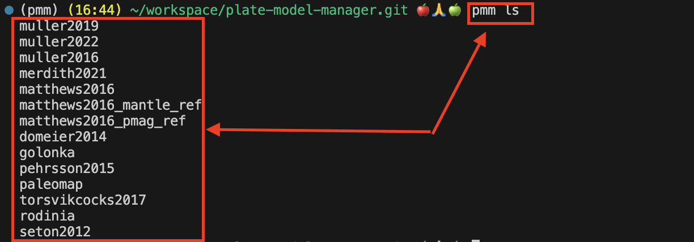
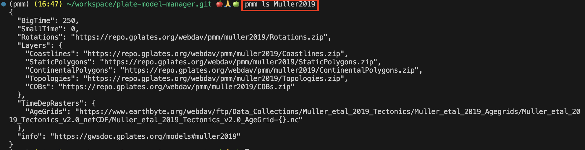
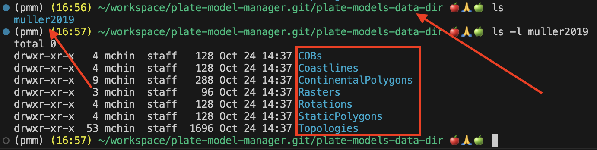
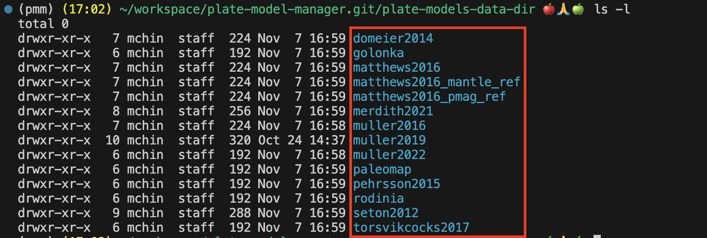
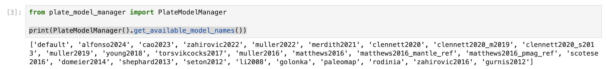
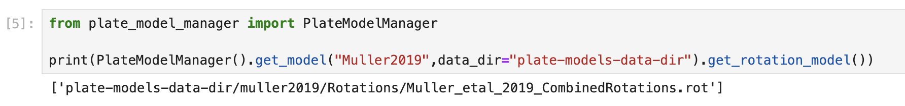

# plate-model-manager


[](https://badge.fury.io/py/plate-model-manager)


Originally the plate-model-manager was designed for [GPlately](https://github.com/GPlates/gplately). Later, it was found also useful in other scenarios and contexts. The plate-model-manager downloads and manages the plate reconstruction model files. It is a dataset manager for plate tectonic reconstruction models, similar to NPM or Conda for software packages.

Have you ever wondered where to get the plate tectonic reconstruction models for your research? Are you tired of downloading files from Internet manually and specify file paths when calling PyGPlates functions? If the answer is yes, you probably want to check out this plate-model-manager Python module.

### How to install

`pip install plate-model-manager`

### How to use

#### Use the command line

- `pmm ls`

  This command will list all available plate tectonic reconstruction models.

  

- `pmm ls Muller2019`

  This command will show the details of model 'Muller2019'.

  

- `pmm download Muller2019 plate-models-data-dir`

  This command will download model "Muller2019" into a folder 'plate-models-data-dir'.

  

- `pmm download all`

  This command will download all available models into the current working directory.

  

#### Use in Python script

👉 The Python code below prints all available model names.

```python
# print all available model names
from plate_model_manager import PlateModelManager

pm_manager = PlateModelManager()
for name in pm_manager.get_available_model_names():
  print(name)
```



👉 The Python code below downloads the "Muller2019" model into folder "plate-models-data-dir".
The model.get_rotation_model() function returns the rotation file location.

```python
from plate_model_manager import PlateModelManager

pm_manager = PlateModelManager()
model = pm_manager.get_model("Muller2019",data_dir="plate-models-data-dir")
print(model.get_rotation_model())
```



### Examples

This Python module is mostly used in [GPlately](https://github.com/GPlates/gplately), [GPlates Web Service](https://github.com/GPlates/gplates-web-service), [PyGPlates Tutorials](https://github.com/GPlates/pygplates-tutorials) and [GPlates Python Proxy](https://github.com/michaelchin/gplates-python-proxy).

A good example of using PlateModelManager with PyGPlates can be found at https://github.com/GPlates/pygplates-tutorials/blob/master/notebooks/working-with-plate-model-manager.ipynb.

The examples of using PlateModelManager with GPlately:

- https://github.com/GPlates/gplately/blob/master/Notebooks/Examples/introducing-plate-model-manager.py
- https://github.com/GPlates/gplately/blob/master/Notebooks/Examples/working-with-plate-model-manager.py

The PlateModelManager can also be used with the GPlates desktop. Use the command line to download the plate model files and open the files with GPlates desktop. This will save the trouble of downloading files from Internet manually.

### Dependencies

- aiohttp
- requests
- nest_asyncio
